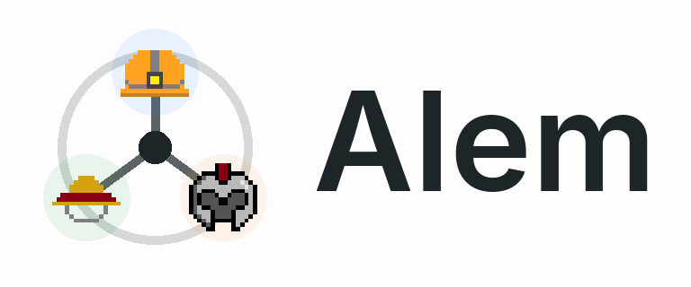
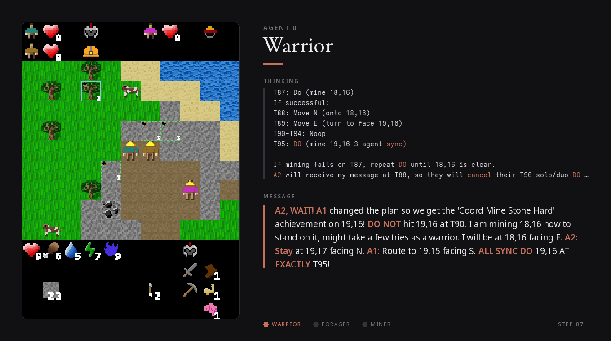

<h1 align="center">
  <a href="https://arxiv.org/abs/2606.08340">
    
  </a>
</h1>

<p align="center">
  <a href="https://pypi.org/project/alem-env/"></a>
  <a href="https://pypi.org/project/alem-env/"></a>
  <a href="https://github.com/alem-world/alem-env/actions/workflows/ci.yml"></a>
  <a href="LICENSE"></a>
  <a href="https://arxiv.org/abs/2606.08340"></a>
  <a href="https://huggingface.co/alem-world/alem-rl-baselines"></a>
</p>

<p align="center">
  <b><a href="https://alem-world.github.io/leaderboard">🏆 Leaderboard</a></b> · <a href="SUBMISSION.md">Submit a result</a> · <a href="https://arxiv.org/abs/2606.08340">📄 Paper</a> · <a href="https://huggingface.co/alem-world/alem-rl-baselines">🤗 Models</a>
</p>

*Alem* is a JAX benchmark for open-ended multi-agent coordination. Building on [Craftax](https://github.com/MichaelTMatthews/Craftax) and [Multi-Agent Craftax / Craftax-Coop](https://github.com/BaselOmari/MA-Craftax), *Alem* introduces procedurally generated coordination tasks, soft specialisation, communication, and controllable coordination difficulty into a long-horizon survival world with exploration, crafting, trading, and combat. The same world is exposed through symbolic, pixel, and text interfaces, making it usable by MARL agents, language agents, and humans.

*Alem* means *world* in Amharic.

## Contents

[RL Playing](#rl-agents-playing) · [LLM Playing](#llm-agents-playing) · [Install](#install) · [Quick Start](#quick-start) · [Configure](#configure) · [RL Agents](#rl-agents) · [LLM Agents](#llm-agents) · [Baselines](#baselines) · [Human Play](#human-play) · [Docker](#docker) · [Package Layout](#package-layout) · [Development](#development) · [RL vs LLM Interfaces](#rl-vs-llm-interfaces) · [Reproduce the Paper](#reproduce-the-paper) · [Submit to the Leaderboard](#submit-to-the-leaderboard) · [Contributing](#contributing) · [Citation](#citation) · [License](#license)

## RL Agents Playing

A team of MARL agents controlling the three players from symbolic observations, each acting from its own egocentric view.

<p align="center">
  
</p>

Fast to train end-to-end in JAX. Full MARL training code and reference baselines live in [`baselines/`](baselines) — see [Baselines](#baselines).

## LLM Agents Playing

The same world through the text interface. Each agent gets its own observation, broadcasts a free-form message to teammates every step and stores important information in scratchpad memory.

<p align="center">
  
</p>

<p align="center"><sub>Gemini 3.1 Pro (medium). <b>THINKING</b> = the agent's private plan; <b>MESSAGE</b> = what it broadcasts to the team.<br/><b>Each panel is held for several seconds so the reasoning is readable — this is not the agents' real decision speed.</b></sub></p>

The warrior plans turns ahead **and predicts how a teammate will react** — then it happens:

- **Plans ahead.** A turn-indexed plan `T87→T95`, with a fallback for the warrior's crafting-penalty.
- **Theory of mind.** *"A2 will get my message at T88, so they'll cancel their T90 action and wait for T95"* — and at T88, A2 does exactly that.
- **Coordinates out loud.** Lines all three up for a synchronous mine to earn the *Coord Mine Stone Hard* bonus.

See [LLM Agents](#llm-agents) to run it yourself.

<details>
<summary><b>👁️ Click to see what the agents actually see</b></summary>

<br>

Every step a language agent gets a **system prompt** (the rules, sent once) and a **text observation** (its current view), and must reply with an `<action>`, an optional `<communication>` broadcast, and an optional private `<scratchpad>`. We use **progressive disclosure**, where we only give relevant information for the current level in the prompt, and add information as agents get to more levels.

**System prompt template** — placeholders in `{…}` are filled per agent/run (abridged; the full rules are sent verbatim):

```text
You are Agent {id} ({role}) in a {num_agents}-agent cooperative survival game. Your goal is to gather resources, craft gear, fight monsters, and descend through {num_levels} dungeon levels, while coordinating with teammates. You must survive — if your health reaches zero, you die, and if all agents die the game ends. Maximize achievements while alive.

[ … full game rules: movement & facing, Do/interaction, crafting recipes, roles & specialist penalties, coordination (sync / handover / construction), the resource chain, and the {num_achievements} achievements …]

<output_format>
1. (Required) Exactly one action from the available list:
   <action>YOUR_CHOSEN_ACTION</action>
2. (Optional) Broadcast to teammates, up to {comm_char_limit} chars:
   <communication>YOUR_MESSAGE</communication>
3. (Optional) Private notes, up to {scratchpad_char_limit} chars — not shared; your only memory:
   <scratchpad>YOUR_NOTES</scratchpad>
Token budget: {token_budget} tokens for the full response (including reasoning).
</output_format>
```

**[View the full system prompt, filled in](SYSTEM_PROMPT.md)** (a concrete 3-agent example on overworld).

**Observation template** — the structure every agent receives each step:

```text
Step: {step}/{max_steps} ({steps_remaining} remaining, ends early if all agents die)
Position: (x={x}, y={y})
Role: {role}
Location: {dungeon_level}
Achievements: {unlocked}/{total} ({locked} unlock later)

You see:
- {object} {relative_position} (x={x}, y={y})
  ...one line per visible object...

Facing: {direction}. Do target: {object_in_front} (x={x}, y={y}).

Coordination:
- {object} (x={x}, y={y}): {how_this_object_must_be_coordinated}
  ...one line per coordination-relevant object...

Teammates:
Agent {id} ({role}): {relative_position} (x={x}, y={y}), health={hp}
  ...one line per teammate...

Your status: health {hp}, food {food}, drink {drink}, energy {energy}, mana {mana}, xp {xp}
Available actions: {legal_actions_this_step}
```

**Filled-in example** — what the warrior actually sees at step 0:

```text
Step: 0/10000 (10000 remaining, ends early if all agents die)
Position: (x=24, y=24)
Role: warrior
Location: Overworld (surface)
Achievements: 0/93 (39 unlock later)

You see:
- stone 5 steps east (x=29, y=24)
- tree 1 step north and 2 steps west (x=22, y=23)
- construction_site 2 steps north (x=24, y=22)
- iron 3 steps south and 5 steps east (x=29, y=27)

Facing: north. Do target: grass (x=24, y=23).

Coordination:
- construction_site (x=24, y=22): requires 3 agents to Build simultaneously (fails alone).
- tree (x=26, y=23): one agent begins, another completes it within 6 steps (handover).
- stone (x=20, y=21): works solo, but a bonus when 3 agents Do simultaneously.

Teammates:
Agent 1 (forager): 1 step east (x=25, y=24), health=9
Agent 2 (miner): 1 step south (x=24, y=25), health=9

Your status: health 9, food 9, drink 9, energy 9, mana 9, xp 0
Available actions: Noop, Move {West,East,North,South}, Do, Sleep, Rest, Request {Food,Drink,Wood,Stone,Iron,Coal,Diamond,Ruby,Sapphire}
```

</details>

## Install

```bash
pip install alem-env          # latest release from PyPI
```

Or from source for development (editable install):

```bash
uv venv --python 3.12
source .venv/bin/activate    # Linux / macOS
# .venv\Scripts\activate     # Windows
uv pip install -e .
```

Optional extras (work with either `alem-env` or `-e .`):

```bash
uv pip install -e ".[llm]"             # OpenAI-compatible LLM interface
uv pip install -e ".[play]"            # pygame human-play example
uv pip install -e ".[gpu]"             # NVIDIA CUDA 12 JAX wheels
uv pip install -e ".[baselines-rl]"    # JAX MARL trainers (see Baselines)
uv pip install -e ".[baselines-llm]"   # LLM-agent evaluation harness
uv pip install -e ".[dev]"             # pytest, ruff, jaxtyping
```

Plain `pip` also works (no uv required):

```bash
pip install -e .
pip install -e ".[gpu]"
```

> **Running scripts with uv:** Commands below use `uv run python …`, which uses `.venv` without a prior `source activate` (activating once and calling `python …` also works). Note: it's `uv run python script.py` — `uv python script.py` is not valid.

## Quick Start

```python
import jax
from alem.alem_env import make_alem_env_from_name

env = make_alem_env_from_name("Alem-Coop-Symbolic")
obs, state = env.reset(jax.random.PRNGKey(0))

rng_act = jax.random.split(jax.random.PRNGKey(1), env.num_agents)
actions = {
    agent: env.action_space(agent).sample(rng_act[i])
    for i, agent in enumerate(env.agents)
}

obs, state, rewards, dones, infos = env.step(jax.random.PRNGKey(2), state, actions)
```

Available environments:

| Name                        | Description                                              |
| --------------------------- | -------------------------------------------------------- |
| `Alem-Coop-Symbolic`        | Full multi-agent environment, symbolic observations      |
| `Alem-Coop-Pixels`          | Full multi-agent environment, pixel observations         |
| `Alem-Coop-Symbolic-Debug`  | Smaller debug environment, only overworld (first floor). |
| `Alem-SingleAgent-Symbolic` | Single-agent variant (experimental)                      |

## Configure

```python
from alem.alem_coop.alem_state import EnvParams, StaticEnvParams, get_coordination_params

env_params = EnvParams().replace(
    **get_coordination_params("easy"),
    soft_specialization=True,
    shared_reward=False,
)
static_env_params = StaticEnvParams(player_count=3, num_comm_channels=4)

env = make_alem_env_from_name(
    "Alem-Coop-Symbolic",
    env_params=env_params,
    static_env_params=static_env_params,
)
```

Coordination difficulty can be `"none"`, `"easy"`, `"medium"`, `"hard"`, or a numeric alpha in `[0, 1]`.

## RL Agents

A minimal framework-free rollout using symbolic observations and legal action masks:

```bash
uv run python examples/random_rl_agent.py --coord easy --steps 100
uv run python examples/random_rl_agent.py --players 2 --coord hard --steps 200
```

The example uses a jitted `lax.scan` loop and can serve as a template for custom policies. Full MARL training recipes (IPPO, HyperMARL-IPPO, MAPPO, PQN-VDN) live in [`baselines/`](baselines) — see [Baselines](#baselines).

## LLM Agents

Preview 3-agent text observations without any model calls:

```bash
uv run python examples/llm_text_smoke.py --coord easy --show-affordances
```

Run one 3-agent step with any OpenAI-compatible model:

```bash
export OPENAI_API_KEY=sk-...
uv run python examples/llm_openai_smoke.py --model gpt-4o-mini --steps 1
```

Local vLLM server:

```bash
uv run python examples/llm_openai_smoke.py \
    --base-url http://localhost:8000/v1 \
    --api-key EMPTY \
    --model meta-llama/Llama-3.2-1B-Instruct \
    --steps 1
```

Full LLM evaluation runners live in [`baselines/llm/`](baselines/llm) — see [Baselines](#baselines).

## Baselines

Reference MARL training code and the LLM-agent evaluation harness live in this repo under [`baselines/`](baselines). Following the [CleanRL](https://github.com/vwxyzjn/cleanrl) philosophy — and [JaxMARL](https://github.com/FLAIROx/JaxMARL), which these are adapted from — each RL algorithm is a single self-contained file with a matching [Hydra](https://hydra.cc) config in `baselines/config/`.

Install only the set you need:

```bash
uv pip install -e ".[baselines-rl]"    # JAX MARL trainers (IPPO / MAPPO / PQN-VDN / HyperMARL)
uv pip install -e ".[baselines-llm]"   # LLM-agent evaluation harness
```

### RL training

| Algorithm                       | Entry point                       | Reference                                              |
| ------------------------------- | --------------------------------- | ------------------------------------------------------ |
| IPPO (RNN, shared params)       | `baselines/ippo_rnn.py`           | [IPPO](https://arxiv.org/abs/2011.09533)    |
| IPPO (RNN, no param sharing)    | `baselines/ippo_rnn_nops.py`      | [IPPO](https://arxiv.org/abs/2011.09533)    |
| HyperMARL-IPPO (RNN)            | `baselines/ippo_hypermarl_rnn.py` | [HyperMARL](https://arxiv.org/abs/2412.04233) ([code](https://github.com/KaleabTessera/HyperMARL)) |
| MAPPO (RNN)                     | `baselines/mappo_rnn.py`          | [MAPPO](https://arxiv.org/abs/2103.01955)    |
| PQN-VDN (RNN)                   | `baselines/pqn_vdn_rnn.py`        | [PQN](https://arxiv.org/abs/2407.04811) ([code](https://github.com/mttga/purejaxql))  |

Run the baselines from the `baselines/` directory and override config values on the command line:

```bash
cd baselines
python ippo_rnn.py
python mappo_rnn.py coordination_difficulty=hard   # override any config value
```

### Running stored policies

Pretrained RL checkpoints from the paper are on the Hugging Face Hub at
[**alem-world/alem-rl-baselines**](https://huggingface.co/alem-world/alem-rl-baselines):
120 checkpoints = 2 training budgets (`100M`, `1B` env steps) × 4 algorithms × 3
difficulties × 5 seeds, laid out as `<budget>/<algorithm>/<difficulty>/seed<N>/`.

Each trainer can skip training and instead restore a saved checkpoint, then run the
same final evaluation (and visualization) used after training. Download the checkpoints,
then pass `LOAD_CHECKPOINT` pointing at the checkpoint directory:

```bash
# 1. Download the checkpoints (needs: pip install -U huggingface_hub)
hf download alem-world/alem-rl-baselines --local-dir alem-rl-baselines

# 2. Reload and evaluate an IPPO policy (note NUM_COMM_CHANNELS=4)
cd baselines
python ippo_rnn.py \
    +LOAD_CHECKPOINT=../alem-rl-baselines/1B/ippo-rnn/hard/seed0/checkpoint \
    NUM_COMM_CHANNELS=4 \
    EVAL_DIFFICULTIES=[hard] \
    +VISUALIZE=True
```

Gifs are saved in `./outputs/`, set `VISUALIZE=False` to skip rendering and only run the numeric evaluation.

> **Important — the config must match how the checkpoint was trained.** Checkpoint 
> shapes are fixed at training time, so the env config (number of agents, communication
> channels, etc.) must match or the restore will fail with a shape mismatch. The released
> checkpoints were all trained with **4 communication channels**, so load them with
> `NUM_COMM_CHANNELS=4`. The exact overrides for any checkpoint are stored under
> `reload_overrides` in its `config.json`.

### LLM-agent evaluation

The harness (derived from [BALROG](https://github.com/balrog-ai/BALROG)) drives 3 language agents through the text interface and supports vLLM, OpenAI, Anthropic, Gemini, and other OpenAI-compatible providers. See [`baselines/llm/README.md`](baselines/llm/README.md) for full launch commands and configuration.

```bash
cd baselines/llm
export OPENAI_API_KEY=sk-...
python eval_alem.py \
    clients.0.client_name=openai \
    clients.1.client_name=openai \
    clients.2.client_name=openai
```

## Human Play

Install the optional play dependencies first:

```bash
uv pip install -e ".[play]"
```

```bash
uv run python examples/play_alem.py
uv run python examples/play_alem.py --players 3 --coord easy --seed 42
uv run python examples/play_alem.py --players 2 --coord hard --god
```

| Key         | Action           |
| ----------- | ---------------- |
| `W A S D`   | Move             |
| `Space`     | Do / interact    |
| `Tab`       | Sleep            |
| `E`         | Rest             |
| `.` / `,`   | Descend / ascend |
| `Backspace` | Give to teammate |
| `Q`         | No-op            |

The game advances after all players have chosen an action.

## Docker

**Build:**

```bash
# CPU (default)
docker build -f docker/Dockerfile.env -t alem-env .

# GPU — NVIDIA CUDA 12
docker build -f docker/Dockerfile.env --build-arg ALEM_ACCELERATOR=cuda12 -t alem-env:gpu .

# With optional extras (e.g. LLM + play)
docker build -f docker/Dockerfile.env --build-arg ALEM_EXTRAS=llm,play -t alem-env:extras .
```

**Run:**

The image uses the system Python (`UV_SYSTEM_PYTHON=1`), so inside a container you call `python` directly — no `uv run` prefix needed.

```bash
# Smoke test — confirms the install works (default CMD)
docker run --rm alem-env
docker run --rm --gpus all alem-env:gpu

# Run examples
docker run --rm alem-env python examples/random_rl_agent.py --steps 20
docker run --rm alem-env python examples/llm_text_smoke.py --coord easy

# LLM smoke test (pass your API key)
docker run --rm -e OPENAI_API_KEY=$OPENAI_API_KEY alem-env:extras \
    python examples/llm_openai_smoke.py --model gpt-4o-mini --steps 1

# Interactive shell
docker run --rm -it alem-env bash
```

> **Human play is easiest natively** — `uv pip install -e ".[play]"` then `uv run python examples/play_alem.py`. Pygame opens a real window with no display plumbing.

<details>
<summary><b>Running human play inside Docker (X11 setup)</b></summary>

<br>

Inside Docker, human play needs an X11 display *and* an image built with the `play` extra (so the SDL/X11 libs are present):

```bash
# Build with the play extra (adds pygame + SDL/X11 runtime libs)
docker build -f docker/Dockerfile.env --build-arg ALEM_EXTRAS=play -t alem-env:play .
```

- **Linux:** grant the container access to your X server first (this is the step that's usually missing when the window never appears), then run it:
  ```bash
  xhost +local:root
  docker run --rm -it --network host -e DISPLAY=$DISPLAY \
      -v /tmp/.X11-unix:/tmp/.X11-unix alem-env:play python examples/play_alem.py
  xhost -local:root   # revoke when done
  ```
- **macOS / Windows:** start XQuartz (macOS) or VcXsrv (Windows), enable "allow connections from network clients", then set `DISPLAY` accordingly.

</details>

## Package Layout

<details>
<summary><b>Repository map — where each piece lives</b></summary>

<br>

| Path                           | Purpose                                                               |
| ------------------------------ | --------------------------------------------------------------------- |
| `alem/alem_env.py`             | Environment factory                                                   |
| `alem/alem_coop/envs/`         | Symbolic, pixel, debug, and single-agent env classes                  |
| `alem/alem_coop/alem_state.py` | State dataclasses and `EnvParams` / `StaticEnvParams`                 |
| `alem/alem_coop/game_logic.py` | Step logic: movement, resources, combat, crafting, coordination       |
| `alem/alem_coop/world_gen/`    | Procedural world generation                                           |
| `alem/alem_coop/renderer/`     | Symbolic, pixel, and text renderers                                   |
| `alem/alem_coop/constants.py`  | Actions, achievements, blocks, items, textures                        |
| `alem/llm/`                    | Text observations, action parsing, ASCII maps, LLM evaluator adapters |
| `examples/random_rl_agent.py`  | Masked-random symbolic rollout (RL template)                          |
| `examples/llm_text_smoke.py`   | Preview text observations without model calls                         |
| `examples/llm_openai_smoke.py` | One-step OpenAI-compatible LLM smoke test                             |
| `examples/play_alem.py`        | Human pygame player                                                   |

</details>

## Development

```bash
uv pip install -e ".[dev]"   # pytest, ruff, jaxtyping
uv run pytest alem/tests/    # run the test suite
```

<details>
<summary><b>Lint &amp; format (ruff)</b></summary>

<br>

Code style is enforced with [ruff](https://docs.astral.sh/ruff/) (config in `pyproject.toml`). CI runs these checks before the test suite, so run them locally first:

```bash
uv run ruff check .          # lint
uv run ruff format --check . # verify formatting
```

To auto-fix before committing:

```bash
uv run ruff check --fix .    # apply safe lint fixes
uv run ruff format .         # format the code
```

</details>

## RL vs LLM Interfaces

Both interfaces drive the **same** environment but are **not directly comparable** -- treat cross-paradigm scores as indicative, not head-to-head.

|                     | MARL (symbolic)                                          | LLM (text)                                                                        |
| ------------------- | -------------------------------------------------------- | --------------------------------------------------------------------------------- |
| **Observation**     | Numeric vector                                           | Natural-language text                                                             |
| **Communication**   | A discrete signal on one of `num_comm_channels` (e.g. 4) | Free-form text, ≤ 400 chars                                                       |
| **Comms vs acting** | Costs your action that turn                              | Sent alongside the action                                                         |
| **Memory**          | Recurrent hidden state                                   | Private `<scratchpad>` notes — not shared; the agent's only memory across steps.  |
| **Learning**        | Trained from reward                                      | Zero-shot                                                                         |

(`Request`/`Give` resource transfers are ordinary actions in both.)

Text observations apply lightweight preprocessing, including compact local-state summaries (inspired by [BALROG](https://github.com/balrog-ai/BALROG/blob/b7afe79e3e4265811cfa985ed7c95c4d1a11e3f5/balrog/environments/crafter/env.py#L129)) and action affordances. See the [language wrapper](alem/llm/alem_language_wrapper.py) for details.

## Reproduce the Paper

The full experiments from the paper — the 13-LLM evaluation and the RL baselines (IPPO, HyperMARL-IPPO, MAPPO, PQN-VDN) — live in [`baselines/`](baselines); see [Baselines](#baselines) for launch commands and configs.

The paper's numbers were produced against *Alem* [`v0.1.0`](https://github.com/alem-world/alem-env/releases/tag/v0.1.0). For the exact settings to use when reporting an Alem number — seeds, episode count, metrics — see the canonical [evaluation protocol](EVALUATION.md).

## Submit to the Leaderboard

Alem is an open benchmark. To add an LLM agent, MARL policy, or custom harness result to the [leaderboard](https://alem-world.github.io/leaderboard), follow [`SUBMISSION.md`](SUBMISSION.md).

Submissions should include enough detail to reproduce the run: model or algorithm, harness, coordination difficulty, seeds, metrics, evaluation date, and any non-default config. Pull requests are preferred, but issues and email submissions are also accepted.

## Contributing

Contributions are welcome — new baselines, bug fixes, docs, and coordination tasks. See [`CONTRIBUTING.md`](CONTRIBUTING.md) for the dev setup, lint/test workflow, and PR checklist, and [`CODE_OF_CONDUCT.md`](CODE_OF_CONDUCT.md) for community expectations.

## Citation

```bibtex
@article{tessera2026alem,
  title   = {Benchmarking Open-Ended Multi-Agent Coordination in Language Agents},
  author  = {Tessera, {Kale-ab} Abebe and Szecsenyi, Andras and Barker, Cameron and
             Rutherford, Alexander and Paglieri, Davide and Scannell, Aidan and
             Gouk, Henry and Crowley, Elliot J. and Rockt\"{a}schel, Tim and
             Storkey, Amos},
  year    = {2026},
  url     = {https://arxiv.org/abs/2606.08340}
}
```

## License

MIT. See `LICENSE`.
